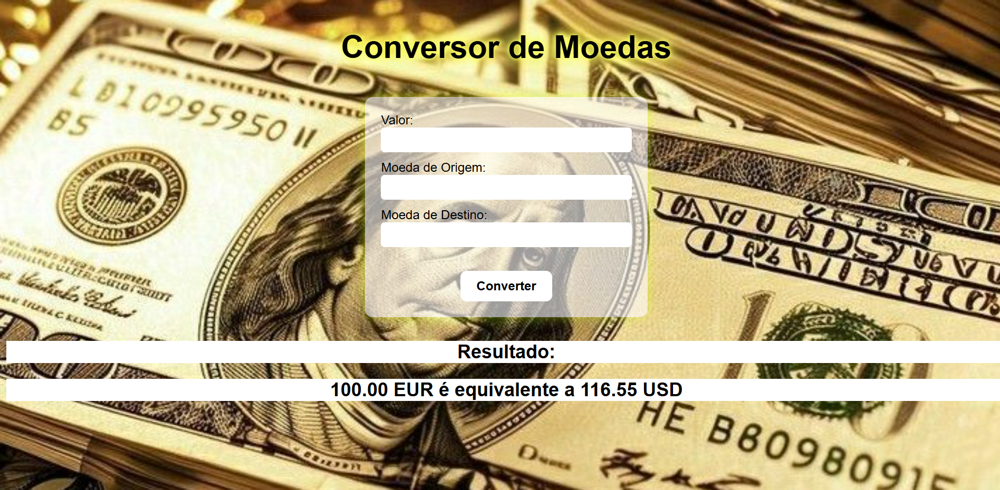

# 🌎 Conversor de Moedas Web

Um simples e funcional conversor de moedas desenvolvido com **Python** e **Flask**.  
Permite converter valores entre diferentes moedas em tempo real, utilizando taxas atualizadas de câmbio.

---

## ✨ Funcionalidades

✅ Conversão rápida e precisa entre diversas moedas.  
✅ Interface simples e intuitiva.  
✅ Taxas de câmbio atualizadas automaticamente.  
✅ Layout responsivo para uso em qualquer dispositivo.  

---

## 🛠 Tecnologias Utilizadas

- **Python 3** → Lógica do back-end  
- **Flask** → Framework para criação da aplicação web  
- **HTML5** → Estrutura das páginas  
- **CSS3** → Estilização e layout responsivo  
- **JavaScript** → Interatividade no front-end  
- **API de Câmbio** → Para obter taxas de câmbio atualizadas  

---

## 📸 Demonstração



---

## 🚀 Como Usar

1. **Clone o repositório**
   ```bash
   git clone https://github.com/PamelaXisto/CONVERSOR_DE_MOEDAS_FLASK.git
